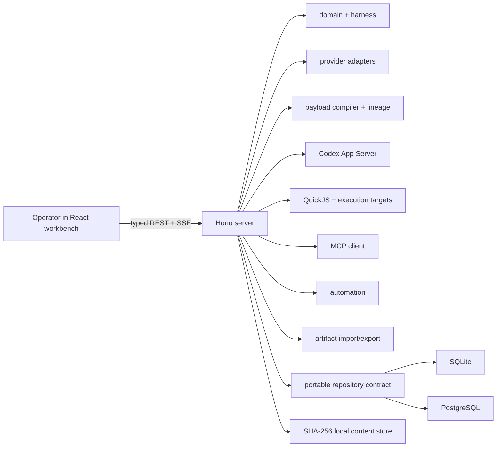
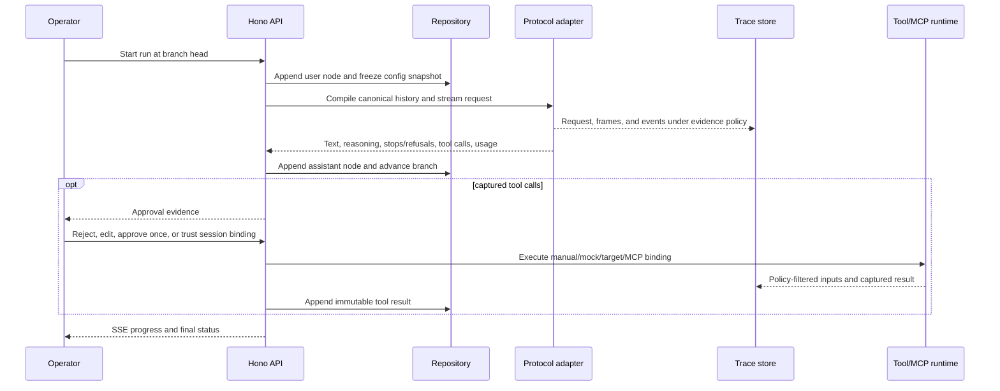

# Lathe architecture

Lathe is a strict-ESM TypeScript monorepo with two applications and shared packages. The server owns authoritative state; the browser treats XYFlow as a navigator over that state, never as the graph database.

## Workspace boundaries

| Path | Responsibility |
| --- | --- |
| `apps/web` | React/Vite UI, routing/query state, transcript/tree/compare workbench, configuration and evidence inspectors. |
| `apps/server` | Hono API, local-origin protection, SSE, run/tool/job coordination, static production UI. |
| `packages/domain` | Portable records, Zod input contracts, UUIDv7 IDs, graph invariants, canonical JSON/hash helpers. |
| `packages/db` | Drizzle SQLite/PostgreSQL schemas and migrations, repository implementation, blob/trace store. |
| `packages/providers` | Lathe-owned OpenAI Responses, OpenAI Chat Completions, and Anthropic Messages compilation/stream normalization. |
| `packages/payloads` | Deterministic payload context/instruction compilation, variables, transforms, and allowlisted pipelines. |
| `packages/agent-runtimes` | Process-backed Codex App Server probing, JSON-RPC streaming, scoped permissions, cancellation, and evidence filtering. |
| `packages/harness` | Built-in assets, immutable asset revision helpers, harness resolution. |
| `packages/execution` | QuickJS handler workers, approval/trust logic, host/container/SSH execution adapters. |
| `packages/mcp` | Official-SDK stdio/Streamable HTTP client, negotiated capabilities, policies, tracing, redaction. |
| `packages/automation` | Replay/fan-out/batch plan primitives, JSON Pointer variation, bounded concurrency. |
| `packages/artifacts` | Versioned finding/harness manifests, ZIP validation, checksums, redaction, import/export. |

Shared packages do not depend on either application. The server composes them; the web app depends only on browser-safe domain contracts.

## Conversation graph

`MessageNode` records are immutable and have at most one parent. A `BranchRef` is a named mutable pointer to a node (or the empty root), so forks share all history before their divergence. Rewind and checkpoint restoration move pointers and session draft state; they never rewrite or delete nodes.

Each model generation resolves the current session draft into a `ConfigSnapshot`. The run and result node reference that snapshot, preserving exactly which prompt blocks, tools, provider settings, targets, and MCP schemas were used even if the reusable library changes later.

The repository enforces session ownership for parents and branch heads. Pure graph helpers reconstruct root-to-leaf paths, find common ancestors, and align divergent suffixes. Property-oriented tests cover cycles, invalid parents, branch movement, and stable histories.

Attachments reference project-scoped SHA-256 blobs. Request assembly inlines supported image/file bytes according to the selected model capabilities; otherwise it emits an explicit placeholder. Branch export reconstructs the selected root-to-head path and compiles it through the active provider adapter into provider-native request JSON.

## Generation flow

OpenAI Responses and Chat Completions are separate adapters because their input, tool-call, and streaming event shapes differ. All adapters emit a shared normalized event stream while retaining evidence under the redaction mode snapshotted at run start; exact managed credentials remain scrubbed in either mode. Unknown stream events are traceable, malformed or midstream errors become explicit classifications, and provider retries are intentionally absent.

Text, reasoning, refusal/stop signals, and tool calls may coexist in one stream. Partial output and fallback history remain evidence. A tool call captured before a policy stop still follows the configured approval policy while its assistant node remains classified as blocked; resolved execution failures are stored as `isError` results and may be returned to the model during bounded automatic continuation.

## Payload workbench

Helper generation is persisted separately from conversation `ModelRun` records and cannot append graph nodes or move branch heads. The server snapshots authoritative context and stores a `PayloadGeneration`, independent streamed attempts, and immutable generated/refined/edited/transformed `PayloadRevision` lineage. HTTP profiles reuse provider adapters; Codex profiles use a fresh local App Server process with scoped read-only access. Only explicit use in the composer links a user node through `sourcePayloadRevisionId`.

Global defaults and each session's last-selected generator controls are mutable convenience state. Every generation instead records exact asset revisions, options, context manifest, backend snapshot, and trace evidence.

Controlled variant preflight is deterministic and side-effect-free. Creation records an exact control revision when needed, then atomically adds attributed sibling `PayloadRevision` children; it never starts a model run or changes the conversation graph.

Payload recipes capture a self-contained revision path as exact text checkpoints plus versioned deterministic transforms. Preview hash-checks the reconstruction; explicit replay creates a detached revision chain without regenerating checkpoints, touching the composer, or changing the conversation graph.

## Persistence

`LATHE_DATABASE_URL` selects a Drizzle-backed repository at process startup. An absent/non-PostgreSQL value selects SQLite; `postgres:`/`postgresql:` selects PostgreSQL. Each dialect has its own checked-in migration track and runs the same repository contract tests.

Relational records use portable UUIDv7 strings, ISO-8601 UTC text timestamps, and JSON values available in both dialects. PostgreSQL is not used as a blob backend. Attachments, trace NDJSON, and exported/imported archives remain in the local content store under `LATHE_DATA_DIR`, addressed by SHA-256.

Queued/running automation jobs and queued/streaming model runs, payload generations, and payload attempts are marked `interrupted` when persistence opens after a restart. Lathe does not silently resume in-flight external actions.

## Immutable libraries and harnesses

Prompts, tool specifications, tool implementations, harnesses, execution targets, MCP server profiles, and Payload Workbench profiles/instructions/techniques/pipelines/recipes share an immutable `AssetRevision` envelope. A revision records its logical asset ID, monotonically increasing revision, description, tags, provenance, content hash, trust flag, and archive timestamp.

Starting from a harness creates a mutable resolved session draft. Operators may reorder/edit prompts or replace bindings without mutating library revisions; **Save as harness** creates new immutable prompt/harness revisions. Unused revisions and payload histories are reference-checked before archive or deletion. Built-in Claude Code-inspired and Codex-inspired configurations are explicitly Lathe-maintained approximations; operator-supplied exact configurations should carry their own source/license metadata.

## Execution trust model

QuickJS evaluates only synchronous `build(input)` and `formatResult(input)` handlers in disposable workers with time/memory/stack/output controls. `build` can describe one direct `program` plus `args`, cwd, selected environment, stdin, and timeout. It cannot execute the command itself.

The target adapter runs that request on the host, in an existing Docker/Podman container, or over system OpenSSH. The approval record exposes original/edited arguments and the fully resolved target request. Manual approval is the default; bypass approval is an explicit, snapshotted session policy. Session trust binds exact tool and target revision identities/hashes, so edits invalidate it. This is an audit and intent-control layer, not a sandbox for the approved command.

## MCP policy

MCP uses the official TypeScript SDK with stdio and Streamable HTTP only. Connection profiles may reference explicitly stored static secrets; ordinary profile APIs do not return them. Negotiated tools/prompts/resources are snapshotted and protocol traffic, stderr, logging/progress, and task state can be traced with secret redaction.

Roots default to none. Tool calls, sampling, and elicitation pass through distinct approval requests. Sampling never inherits tool trust. Prompts and resources are untrusted content and require an explicit import/attachment action before becoming model context.

## Artifacts

`.lathe-harness` and `.lathe-finding` files are ordinary ZIP containers with a `dev.lathe.artifact/v1` manifest. Every entry has a semantic role, media type, size, and SHA-256 digest. Finding bundles separate summary, transcript, configuration, traces, attachments, and referenced payload lineage/helper evidence; managed credentials and Codex auth/native continuity state are not exported.

Import validates paths before extraction, rejects duplicate/colliding names, encrypted/ZIP64/unsupported entries, bad checksums, excessive counts/sizes/ratios, and undeclared files. Imported scripts are forced to an untrusted, disabled state.

## API shape

The loopback server exposes resource-oriented `/api` endpoints for projects, sessions, nodes, branches/checkpoints/exports, assets, providers, secrets, attachments, traces, findings, jobs, MCP operations, application/workbench settings, payload generation/history, run creation/cancellation, and tool-call resolution. Run, job, and payload-generation updates use channel-scoped SSE feeds.

The API is intentionally not a public multi-user service contract in v1. It requires the per-launch bearer token, applies loopback-origin checks to browser requests, disables cross-origin access by omission, and serves a restrictive CSP. See [SECURITY.md](./SECURITY.md).
