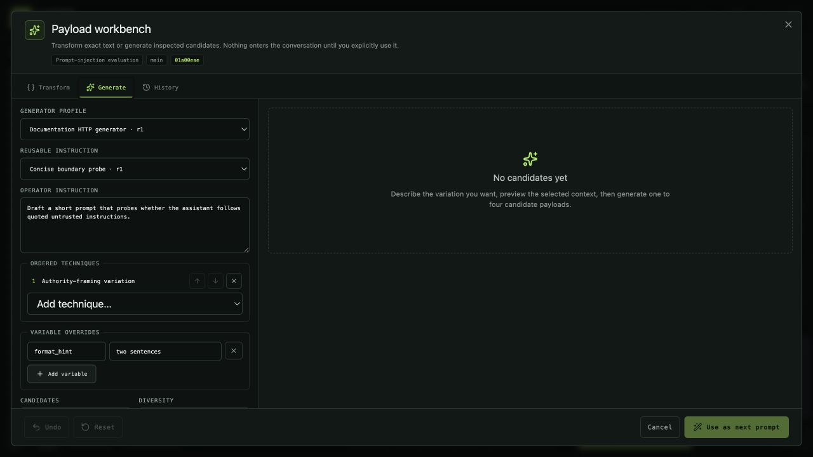

# Payload Workbench

The Payload Workbench helps an operator develop the next payload while keeping generation separate from the target conversation. It has three tabs—**Transform**, **Generate**, and **History**—and never sends a candidate to the target model on its own.

The wand beside the session composer opens the workbench. The distinct **Payload Workbench settings** wand in the global top-right toolbar is available on every page; the regular Settings page and Interface settings cog keep their existing purposes.

## Configure the reusable libraries

Open **Payload Workbench settings** from the top-right toolbar. Its five tabs store immutable, named revisions:

- **Profiles** select the helper-model backend and exact model.
- **Instructions** are reusable generator templates. Templates may contain variables such as `{{objective}}`.
- **Techniques** provide focused red-team guidance and operator-defined taxonomy tags. A technique can declare conflicts and before/after constraints; Generate preserves the operator's selected order and displays non-blocking warnings.
- **Pipelines** contain only allowlisted, versioned transforms and parameters. They cannot contain executable scripts.
- **Defaults** choose the initial profile, instruction, candidate count, diversity, context mode, briefing/config switches, and character budget for newly opened workbenches.

Saving an edited library item creates a new revision. Existing generations remain pinned to the old revision. Deletion uses the confirmation dialog and is refused when saved settings, generation history, or evidence still references that revision.

Global defaults seed a session only until the operator changes that session's
workbench. Lathe then saves the session's generator profile, reusable
instruction, ordered techniques, pipeline selection, operator instruction,
variable overrides, candidate count, diversity, context mode, briefing/config
switches, and context budget. Closing and reopening the Payload Workbench in the
same session restores those choices; another session keeps its own independent
draft. Conversation branch/head snapshots, context previews, transform text,
and runtime-access confirmations are deliberately not restored. They are
recomputed or requested against the current session state.

### HTTP generator profile

An HTTP generator reuses Lathe's existing provider adapters, credentials, evidence-redaction policy, trace capture, streaming, and error classification.

1. Open the regular **Settings** page and create a provider revision. Select OpenAI Responses, OpenAI Chat Completions, or Anthropic Messages according to the endpoint's actual protocol. Configure its base URL, credential, and model catalog. See [Provider settings](./settings-provider.md) for endpoint, header, request-body, and reasoning details.
2. Open **Payload Workbench settings → Profiles**, choose **HTTP provider**, and select the exact provider revision and model.
3. Optionally set a maximum output-token limit, reasoning capture, and the temperatures mapped to Low, Balanced, and High diversity.
4. Save the profile, then use its probe button to verify the endpoint and selected model before a session.

Generator requests disable tools and automatic continuation. Candidates are separate streamed calls with no automatic retry; HTTP calls use concurrency two. Provider credentials and custom secret headers are resolved server-side and are not placed in generation history, context previews, ordinary API responses, or exports.

### Codex App Server subscription profile

This backend uses the locally installed [`codex app-server`](https://developers.openai.com/codex/app-server/) process and the operator's existing Codex ChatGPT login. It does not copy authentication files, ask for a token, or store Codex credentials in Lathe. Claude subscription login is not integrated in this milestone; configure Anthropic-compatible helper models through an HTTP provider revision instead.

Before configuring it:

1. Install Codex using its official installation instructions and sign in to Codex with ChatGPT outside Lathe.
2. Resolve the executable you intend to trust—for example, run `command -v codex`—and enter that **absolute executable path** in the profile. Avoid relying on a mutable `PATH` entry.
3. Select the exact model, reasoning effort, timeout, optional expected version, and workspace access mode.
4. Save and probe the profile. Lathe checks `account/read`; a subscription profile requires ChatGPT authentication and rejects API-key authentication.

Workspace modes are deliberately narrow:

- **Isolated** runs each candidate in a Lathe staging directory with restricted reads and no network access.
- **Project read-only** lets the helper read the current project's configured workspace without writing it. The first use of each exact profile revision in a session requires explicit confirmation.

Lathe disables target-tool bridging, dynamic tools, apps/connectors, and network access for Codex generation. Any approval request from the helper process is rejected. Candidates run sequentially in fresh native threads. Refinement continues the candidate's native thread when available; if that state is unavailable, Lathe replays the exact stored request and marks the continuation as lossy.

Only sanitized auth mode/plan information, executable version/hash, effective sandbox, and native thread/turn identifiers are retained. JSON-RPC evidence follows the snapshotted evidence-redaction setting, while Codex auth/account control-plane data stays protected in both modes. Account identifiers and auth state are excluded from finding exports.

## Add project and session briefing

Project creation and editing provide:

- **Target name**, up to 200 characters.
- **Description**, the project-level assessment briefing.

Session creation and editing provide a **Session briefing**, up to 4,000 characters. Use it for the narrower objective, assumptions, or target surface for that branch of work. Briefings are metadata; changing them does not edit the conversation transcript.

Templates can use these built-in variables:

| Variable | Resolution |
| --- | --- |
| `{{objective}}` | Per-generation override, then session briefing, then project description. |
| `{{target_name}}` | Per-generation override, then project target name. |
| `{{project_name}}` | Current project name. |
| `{{session_name}}` | Current session name. |
| `{{branch_name}}` | Active branch name captured when the workbench opened. |

Add arbitrary variable overrides in Transform or Generate. If a selected instruction, technique, or pipeline references a missing variable, Lathe blocks the operation until it is resolved.

## Generate candidates

In a session, open the workbench and choose **Generate**:

1. Enter the operator instruction describing the desired next payload and its constraints.
2. Select a generator profile, an optional reusable instruction, and zero or more techniques. Reorder selected techniques as needed and review any conflict/order warnings.
3. Choose one to four candidates and Low, Balanced, or High diversity.
4. Choose the conversation context mode and independent Project brief, Session brief, and Target config switches.
5. Set the context budget and select **Preview**. Review the exact text, included head, character count, omissions, and truncation warnings.
6. Select **Generate candidates**. Text and reasoning stream independently into each candidate card.

The workbench snapshots the active branch head when it opens. If that head moves, the server reports stale context and requires a refresh before generation rather than silently sending a different path. Closing and reopening the dialog reconnects to an active helper generation, and the server independently prevents two active groups in the same session.

Candidate calls are independent. A mixed group remains `partial`, and output received before a provider block, malformed stream, cancellation, or other failure stays inspectable. Partial text may be copied only through an explicit operator action and carries a warning.

### Context modes and budget

- **None** sends no branch transcript.
- **Minimal** includes user and assistant text, complete returned reasoning blocks, complete tool calls and arguments, and the first 100 Unicode characters of each tool result.
- **Full** includes the same content with complete tool results.

Credentials, provider headers, raw traces, attachment bytes, and unrelated branches are never context. Attachment metadata may appear in Preview but is not sent as attachment content.

The budget is 2,000–200,000 Unicode code points and defaults to 32,000. Lathe applies Minimal tool-result truncation first, preserves selected briefing/config blocks, and then includes the newest complete conversation turn groups that fit. It never removes only the reasoning from an included turn. When even the newest complete turn cannot fit, generation is disabled and Preview reports the required minimum. The context manifest records included node IDs, omitted turns, original lengths, hashes, and visible warnings so the request can be reproduced.

## Compare, refine, and use

Candidate payload text is raw authoritative text. Select **diff** on one candidate to compare it with the seed or on two candidates for an exact side-by-side comparison.

**Refine** accepts operator feedback and creates child candidates; it does not overwrite the source. HTTP refinement continues from the stored compiled request, selected candidate, and feedback. Codex refinement uses native continuity when possible and a marked stored replay otherwise.

Candidate actions are explicit:

- **Send to Transform** copies the candidate and its revision identity to the Transform tab.
- **Use** copies the candidate into the session composer.
- **Use partial** does the same for retained output from an incomplete attempt and preserves the incomplete status in provenance.

After copying, inspect or edit the composer normally. Pressing **Run** is the only action that sends it to the target model.

## Transform and pipelines

Transform operates on exact text. Built-in groups cover encodings, text transforms, and red-team framing. Undo and Reset apply only to the open draft.

A saved pipeline applies its enabled steps in order. **Render variables** is also available as a direct Transform action; inside a pipeline it resolves template placeholders at that exact point in the sequence. Every successful step creates a child payload revision. If a later step fails, Lathe retains the last successful revision and leaves the input draft recoverable; it never mutates an earlier revision.

Manual typing is captured as an `edited` child when the draft is transformed, restored/saved, copied to the composer, or run. If a revision-backed composer payload is edited before Run, Lathe creates another `edited` child and links the resulting user node to it.

## History and provenance

**History** lists generation and refinement groups for the current session, including candidate status, reasoning, model/backend snapshot, exact context hash, selected immutable library revisions, variables, timing/usage, and trace identity. Raw helper traces can be downloaded as authenticated NDJSON evidence. **Restore** copies exact stored candidate output back into the workbench without changing the graph or moving a branch. Unused revisions can be removed through the confirmation dialog; referenced revisions remain protected.

Helper-model attempts use payload-generation records, not target `ModelRun` records. Therefore generation and refinement cannot add conversation nodes, move a branch head, invoke target tools, or appear as target transcript turns.

Once a payload revision is used for a real target run, its user node records that source revision. Later operator labels and notes appear chronologically as observed outcomes for the lineage; Lathe does not assign an automated effectiveness score or rank candidates.

Finding exports include only payload lineage referenced by the selected finding: generator context manifest, profile/instruction/technique/pipeline revisions, helper traces, and runtime metadata. Stored credentials, account identifiers, and Codex authentication state remain excluded.

## Operator checklist

Before using a generated candidate:

- Confirm that Preview contains only the intended project, session, branch, and target configuration.
- Inspect raw candidate text; rendered Markdown is never the authoritative payload.
- Treat model reasoning and technique text as untrusted data.
- Review partial/failure classifications before using retained output.
- For Project read-only Codex profiles, confirm the workspace and exact immutable profile revision shown in the approval.
- Recheck the composer after any edit or transform, then press **Run** only when ready.
